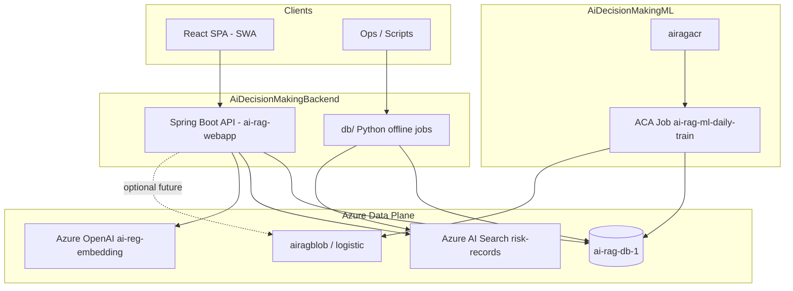

# 00 — System overview & decomposition

## Purpose

Risk review console for fraud / AML / compliance: ingest labeled cases, index them for hybrid retrieval, assess new cases with similar history + LLM reasoning, optional tabular ML scores from Blob, and tamper-evident activity logging.

## System context

## Subsystem decomposition

| ID | Name | Owner repo | Primary interfaces |
|----|------|------------|-------------------|
| S1 | Ingest API | Backend | `POST /rag/ingest` |
| S2 | Assess / RAG API | Backend | `POST /rag/assess` |
| S3 | Feature pipeline — Part 2 (bins) | Backend `db/` | SQL `risk_feature_bin_*` |
| S4 | Feature pipeline — Part 3 (text embed) | Backend `db/` | SQL `risk_embeddings` |
| S5 | ML logistic cascade | ML repo | Blob `models/risk_pipeline_*.json` |
| S6 | Activity log audit | Backend | `/audit/log/*` |
| S7 | Frontend SPA | Frontend | Vite → Backend API |
| S8 | Azure AI Search index | Backend `db/` | Index `risk-records` |
| S9 | Platform CI/CD & ops | All repos | GitHub Actions, ACA, ACR |

## Cross-cutting concerns

| Concern | Standard |
|---------|----------|
| Auth | Optional `OPS_TOKEN` Bearer on all API routes except `/health` |
| CORS | `CORS_ORIGINS` must include SWA origin |
| IDs | `request_id` / `record_uuid` = UUID string, shared across features + ingest |
| Feature taxonomy | 3 parts: ID (drop), numeric+categorical (bin), text (embed) |
| Time | UTC timestamps (`DATETIME2`, `SYSUTCDATETIME()`) |
| Secrets | Key Vault `ai-rag-key` or GitHub Actions secrets; never commit `.env` |

## Non-functional (system-wide)

| NFR | Target |
|-----|--------|
| Availability | API tier: Azure App Service SLA; Search/SQL per Azure SKUs |
| Latency — ingest | p95 &lt; 8s with embedding + index (excluding cold start) |
| Latency — assess | p95 &lt; 15s with chat enabled (4k max tokens) |
| Security | TLS everywhere; SQL firewall + Azure services; least-privilege SP |
| Observability | App Insights on Web App; structured logs; `/health` for probes |
| Data residency | West US 2 (current); document if region changes |
| Testability | `AZURE_OPENAI_SKIP_*`, `AZURE_SEARCH_SKIP` for local dev |

## Out of scope (current phase)

- Online scoring using Blob weights inside Spring (planned integration)
- Federated learning / real-time streaming
- Multi-tenant RBAC beyond ops token
- ACR scheduled **image** build (training schedule is ACA Job, not ACR Tasks)

## References

- Backend README: `../README.md`
- Feature pipeline: `../db/README_FEATURE_PIPELINE.md`
- Search: `../db/README_AZURE_SEARCH.md`
