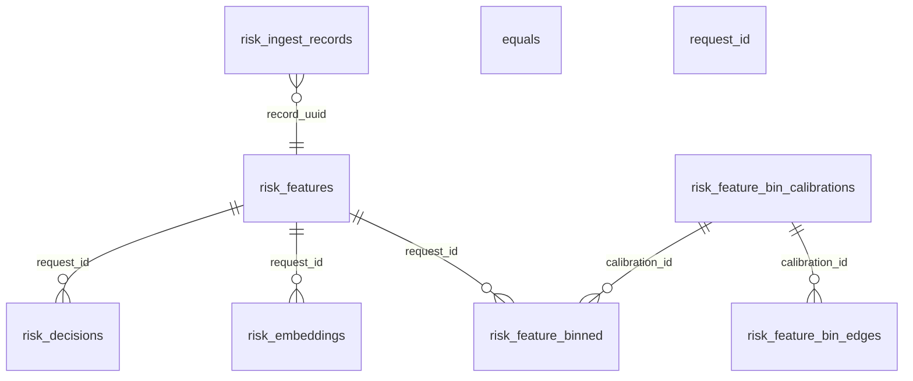

# 08 — Database schema (Azure SQL)

**Database:** `ai-rag-db-1` on `ai-rag-sql-server.database.windows.net`  
**Migrations:** `db/V1__` … `db/V7__` via `python db/run_migrations.py`

## ER overview

## Table: `risk_ingest_records` (V1)

| Column | Type | Constraints | Description |
|--------|------|-------------|-------------|
| id | BIGINT IDENTITY | PK | Surrogate key |
| record_uuid | CHAR(36) | NOT NULL | Same as `risk_features.request_id` |
| review_outcome | VARCHAR(10) | NOT NULL | `passed` \| `rejected` \| `frozen` |
| text | NVARCHAR(MAX) | NULL | Case notes |
| metadata | NVARCHAR(MAX) | NULL | JSON string |
| created_at | DATETIME2 | DEFAULT UTC | Insert time |

**Indexes:** by `record_uuid`, `created_at`.

## Table: `risk_features` (V2)

| Column | Type | Description |
|--------|------|-------------|
| id | BIGINT | PK |
| request_id | CHAR(36) | UNIQUE — canonical case id |
| source | VARCHAR(32) | `ingest` \| `risk-similarity` |
| scenario, transaction_id, user_id, device_id | VARCHAR | Denormalized from JSON |
| country_code | VARCHAR | |
| withdraw_amount, deposit_amount, total_amount | DECIMAL | |
| features_json | NVARCHAR(MAX) | Full feature blob (UI schema) |
| created_at | DATETIME2 | |

**FK consumers:** `risk_decisions`, `risk_embeddings`, `risk_feature_binned`.

## Table: `risk_decisions` (V3)

| Column | Type | Description |
|--------|------|-------------|
| id | BIGINT | PK |
| request_id | CHAR(36) | FK → `risk_features` |
| decision | VARCHAR(10) | `pass` \| `reject` \| `freeze` |
| is_final | BIT computed | 1 if pass/reject |
| reason | NVARCHAR(MAX) | Audit text |
| decided_by | NVARCHAR(200) | e.g. `system`, analyst id |
| created_at | DATETIME2 | |

**Note:** Multiple rows per request allowed (freeze → pass/reject history).

## Table: `risk_embeddings` (V4)

| Column | Type | Description |
|--------|------|-------------|
| id | BIGINT | PK |
| request_id | CHAR(36) | FK |
| embedding_type | VARCHAR(32) | `feature`, `email`, `conversation`, `text_combined`, … |
| embedding_json | NVARCHAR(MAX) | JSON array of floats |
| dimensions | INT | e.g. 1536 |
| model_name, model_version | VARCHAR | |
| created_at | DATETIME2 | |

**Unique:** `(request_id, embedding_type, model_name)`.

## Table: `activity_log` (V5)

| Column | Type | Description |
|--------|------|-------------|
| id | BIGINT | PK |
| user_id | NVARCHAR(200) | |
| transaction_id | NVARCHAR(200) | |
| biz_action | VARCHAR(10) | `pass` \| `reject` \| `freeze` |
| record_action | VARCHAR(10) | `add` \| `delete` \| `restore` |
| prev_hash | NVARCHAR(64) | Chain link |
| hash_code | NVARCHAR(64) | SHA-256 chain |
| created_at | DATETIME2 | |

## Tables: bin calibration (V6 + V7)

### `risk_feature_bin_calibrations`

| Column | Description |
|--------|-------------|
| calibration_id | CHAR(36) PK — active: `00000000-0000-0000-0000-000000000001` |
| n_bins | Default 5 |
| strategy | `quantile+categorical_onehot` |
| training_row_count | |
| numeric_feature_count, categorical_feature_count | |
| id_features_json, numeric_features_json, categorical_features_json | |
| flatten_dim, flatten_layout_json | Global one-hot layout |

### `risk_feature_bin_edges`

| Column | Description |
|--------|-------------|
| calibration_id + feature_name | PK |
| feature_kind | `numeric` \| `categorical` |
| edges_json | Quantile boundaries (numeric) |
| bin_counts_json | |
| sample_size | |
| encoding_json | one-hot offsets, category maps |

### `risk_feature_binned`

| Column | Description |
|--------|-------------|
| request_id + calibration_id | PK |
| binned_json | Human-readable bins |
| vector_json | Legacy numeric bin indices |
| onehot_json | Flattened 0/1 vector for ML |
| active_spots_json | Feature → global index |
| flatten_dim | |

## Database support (operational)

| Task | Tool |
|------|------|
| Apply migrations | `python db/run_migrations.py` |
| Seed samples | `python db/seed_data.py` |
| Connection | `db/.env` or App Service JDBC settings |

## Unit tests (schema-level)

| Test | Location | Assert |
|------|----------|--------|
| Migrations idempotent | Manual / integration | Re-run V1–V7 without error |
| FK reject orphan decision | SQL integration | Insert decision without feature fails |
| CK decision values | SQL | Invalid `decision` rejected |
| CK embedding_type | V6 migration | Only allowed types |

## Non-functional

| NFR | Target |
|-----|--------|
| Backup | Azure SQL automated backup / PITR enabled |
| Encryption | TDE at rest; TLS in transit |
| Scale | Start S0/S1; monitor DTU/vCore for ingest bursts |
