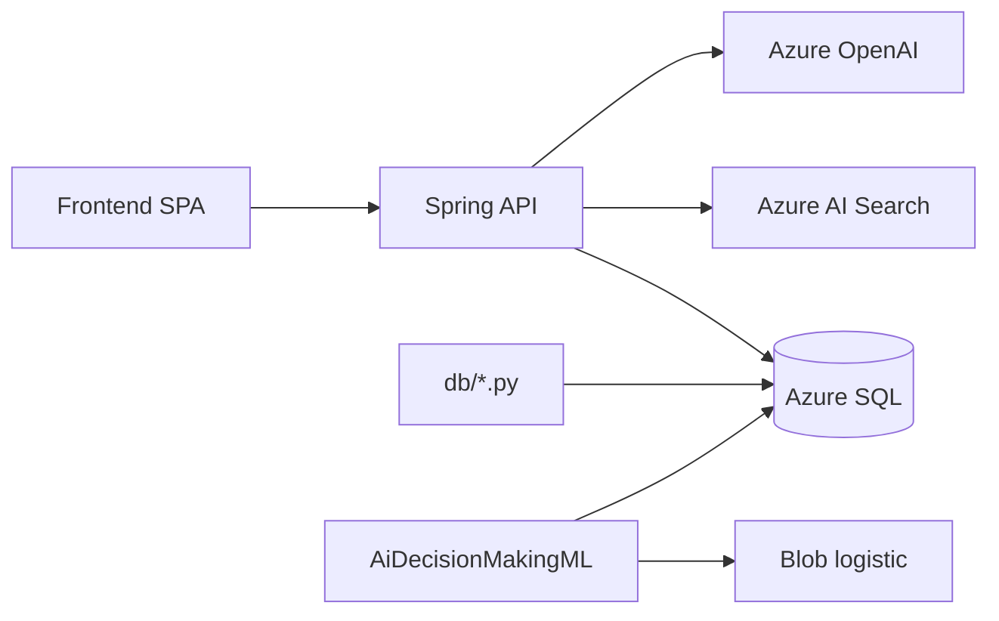

# AI Decision Making — Backend

Spring Boot API, Azure SQL migrations, and offline Python jobs for the **AI RAG risk-review console**. This repo is one of three; see [Related repositories](#related-repositories).

> **Synthetic data & schema disclaimer**  
> All **database schemas**, **feature taxonomies**, **seed/sample rows**, **Azure Search index fields**, and **demo case content** in this project were **generated by AI** for illustration and development. They do **not** represent real customers, production fraud rules, or regulated PII. Do not use seeded data for compliance, benchmarking, or production decisions without replacing it with your own governed data model.

## Related repositories

| Repository | Role |
|------------|------|
| [AiDecisionMakingFrontend](https://github.com/michaelgsx/AiDecisionMakingFrontend) | React SPA (Ingest + Assess) |
| [AiDecisionMakingML](https://github.com/michaelgsx/AiDecisionMakingML) | Daily logistic train → Azure Blob |
| **This repo** | REST API, `db/` migrations & offline pipeline |

**Design specs (AI codegen):** [`.ai/README.md`](./.ai/README.md) — subsystem decomposition, DB design, CI/CD, tests.

**Branch:** `v1` (deployed to App Service `ai-rag-webapp`).

## What this repo does

- **Ingest** labeled risk cases → SQL + embeddings + Azure AI Search index `risk-records`.
- **Assess** new cases via hybrid search + optional Azure OpenAI chat (structured JSON: reasoning + evidence).
- **Audit** tamper-evident `activity_log` hash chain.
- **Offline jobs** (`db/`): migrations, quantile bin calibration, text embeddings, Search backfill.



## Project structure

```
├── .ai/                         # Design docs for AI-assisted regeneration
├── db/                          # Migrations V1–V7, offline pipeline scripts
│   ├── V*.sql
│   ├── run_migrations.py
│   ├── seed_data.py             # AI-generated sample rows (not production data)
│   ├── offline_bin_calibration.py
│   ├── embed_text_features.py
│   ├── backfill_azure_search.py
│   └── README_AZURE_SEARCH.md
├── backend/                     # Spring Boot 3 (Java 17+)
│   └── src/main/java/com/aidecision/backend/
└── .github/workflows/           # deploy-backend.yml → App Service
```

## API endpoints

| Method | Path | Description |
|--------|------|-------------|
| POST | `/rag/ingest` | Save case (`passed` \| `rejected` \| `frozen`) |
| POST | `/rag/assess` | Similar cases + optional LLM label |
| GET | `/health` | DB connectivity |
| POST | `/audit/log` | Append audit entry |
| GET | `/audit/log` | List audit entries |
| GET | `/audit/log/verify/{userId}` | Verify hash chain |

Optional auth: `Authorization: Bearer <OPS_TOKEN>` on all routes except `/health`.

### POST `/rag/ingest`

```json
{
  "text": "optional case notes",
  "metadata": "{\"scenario\":\"login_anomaly\",...}",
  "reviewOutcome": "passed"
}
```

Pipeline: embed → `risk_features` + `risk_ingest_records` + `risk_embeddings` → Azure AI Search document.

### POST `/rag/assess`

Request: `{ "text": "...", "metadata": "{...features...}" }`

| Field | Source |
|-------|--------|
| `risk`, `reason` | Search summary (not the LLM) |
| `similarRecords` | Hybrid retrieval |
| `aiLabel`, `aiReasoning`, `aiEvidence`, `aiConfidence`, `aiKeyRiskFactors` | Chat when `AZURE_OPENAI_CHAT_DEPLOYMENT` is set |

**Assess LLM JSON** (`response_format: json_object`) — full example in [`.ai/schemas/assess-llm-response.json`](./.ai/schemas/assess-llm-response.json).

## Quick start (local)

### 1. Database

```bash
cd db
pip install -r requirements.txt
cp .env.example .env    # Azure SQL credentials
python run_migrations.py
python seed_data.py     # optional: AI-generated demo rows only
```

### 2. API

```bash
cd backend
cp .env.example .env    # SQL, OpenAI, Search keys
./mvnw spring-boot:run
```

Default port **8787** (`PORT` overrides). Spring loads `backend/.env` before `application.yml`.

### 3. Frontend

In the frontend repo:

```env
VITE_API_BASE_URL=http://localhost:8787
```

## Azure configuration (production)

Set on App Service **Configuration** (or Key Vault `ai-rag-key`):

| Area | Variables |
|------|-----------|
| SQL | `AZURE_SQL_*` / JDBC |
| OpenAI | `AZURE_OPENAI_ENDPOINT`, `AZURE_OPENAI_API_KEY`, embedding + chat deployment names |
| Search | `AZURE_SEARCH_ENDPOINT`, `AZURE_SEARCH_ADMIN_KEY`, `AZURE_SEARCH_INDEX_NAME=risk-records` |
| Ops | `OPS_TOKEN`, `CORS_ORIGINS` (Static Web App origin) |

GitHub Action **deploy-backend.yml** deploys the JAR only; secrets stay in Azure/GitHub, not in git.

See also: `db/README_AZURE_SEARCH.md`, `db/README_FEATURE_PIPELINE.md`, [`.ai/10-cicd-and-ops.md`](./.ai/10-cicd-and-ops.md).

## Offline feature pipeline

After ingest data exists:

```bash
python db/offline_bin_calibration.py --save-db
python db/embed_text_features.py
python db/backfill_azure_search.py   # after index create
```

Bin calibration ID (demo): `00000000-0000-0000-0000-000000000001`.

## Tests

```bash
cd backend && ./mvnw test
```

## License & use

Demonstration stack for AI-assisted risk review workflows. Replace synthetic schemas and seed scripts before any production or regulatory use.
